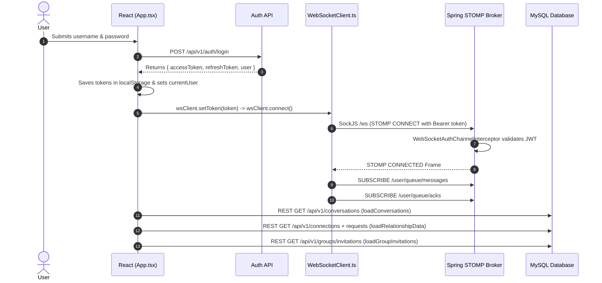
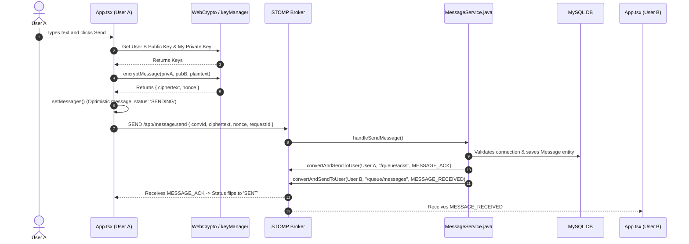
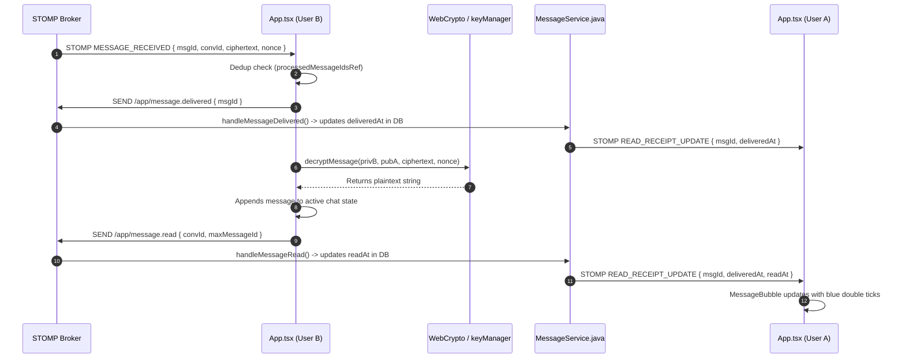
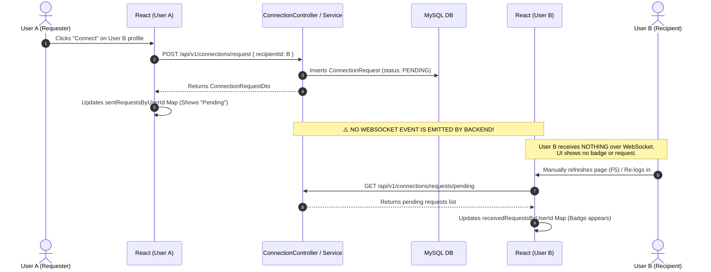
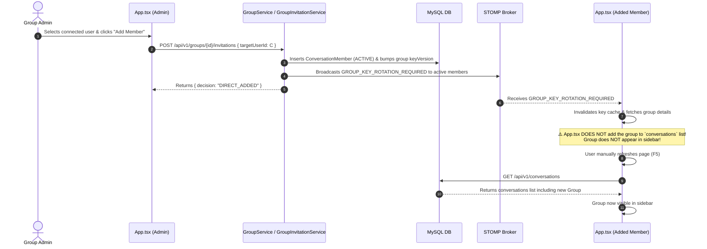
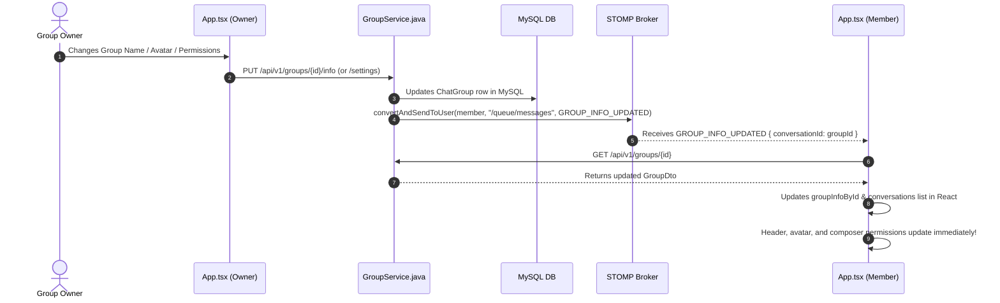
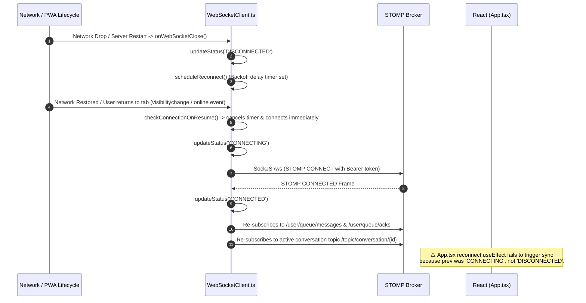
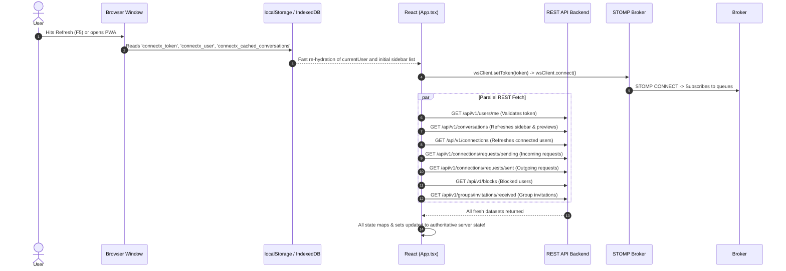

# CONNECTX — COMPLETE REAL-TIME / WEBSOCKET / STATE SYNCHRONIZATION
## READ-ONLY ARCHITECTURE AUDIT

> **AUDIT STATUS**: FORENSIC / READ-ONLY AUDIT  
> **CODEBASE BASELINE**: `ConnectX-The Secure Messaging Service` (connectx-backend + connectx-frontend)  
> **RULE ADHERENCE**: No source code modified. No dependencies altered. No configuration changed. No bug fixes applied. All findings derived directly from code inspection.

---

## 1. PROJECT ARCHITECTURE

### 1.1 Technology Stack & Versions

| Layer | Technology | Version | Location / Config Source |
| :--- | :--- | :--- | :--- |
| **Frontend Framework** | React | `^18.2.0` | [`connectx-frontend/package.json`](file:///d:/Vamsi/ConnectX-The%20Secure%20Messaging%20Service/connectx-frontend/package.json#L15) |
| **Frontend Tooling** | Vite + TypeScript | `^5.1.6` / `^5.2.2` | [`connectx-frontend/package.json`](file:///d:/Vamsi/ConnectX-The%20Secure%20Messaging%20Service/connectx-frontend/package.json#L28-L29) |
| **Frontend Styling** | TailwindCSS + PostCSS | `^3.4.17` / `^8.4.47` | [`connectx-frontend/package.json`](file:///d:/Vamsi/ConnectX-The%20Secure%20Messaging%20Service/connectx-frontend/package.json#L26-L27) |
| **Frontend Icons** | Lucide React | `^0.344.0` | [`connectx-frontend/package.json`](file:///d:/Vamsi/ConnectX-The%20Secure%20Messaging%20Service/connectx-frontend/package.json#L14) |
| **Frontend WS Client** | `@stomp/stompjs` + `sockjs-client` | `^7.3.0` / `^1.6.1` | [`connectx-frontend/package.json`](file:///d:/Vamsi/ConnectX-The%20Secure%20Messaging%20Service/connectx-frontend/package.json#L13-L17) |
| **Backend Framework** | Spring Boot | `3.3.2` | [`connectx-backend/pom.xml`](file:///d:/Vamsi/ConnectX-The%20Secure%20Messaging%20Service/connectx-backend/pom.xml#L10) |
| **Java Runtime** | OpenJDK / Java | `21` | [`connectx-backend/pom.xml`](file:///d:/Vamsi/ConnectX-The%20Secure%20Messaging%20Service/connectx-backend/pom.xml#L21) |
| **Database** | MySQL (with H2 test fallback) | `mysql-connector-j` (runtime) | [`connectx-backend/pom.xml`](file:///d:/Vamsi/ConnectX-The%20Secure%20Messaging%20Service/connectx-backend/pom.xml#L83-L86) |
| **Database ORM** | Spring Data JPA / Hibernate | 3.3.2 Starter | [`connectx-backend/pom.xml`](file:///d:/Vamsi/ConnectX-The%20Secure%20Messaging%20Service/connectx-backend/pom.xml#L39-L42) |
| **WebSocket Technology**| Spring WebSocket + STOMP Broker | `spring-boot-starter-websocket` | [`connectx-backend/pom.xml`](file:///d:/Vamsi/ConnectX-The%20Secure%20Messaging%20Service/connectx-backend/pom.xml#L45-L48) |
| **Security & Auth** | Spring Security + JJWT | `0.12.5` | [`connectx-backend/pom.xml`](file:///d:/Vamsi/ConnectX-The%20Secure%20Messaging%20Service/connectx-backend/pom.xml#L63-L80) |
| **Cryptography (Web)** | Web Crypto API (SubtleCrypto) | Native Browser (P-256 ECDH + AES-256-GCM) | [`connectx-frontend/src/crypto/`](file:///d:/Vamsi/ConnectX-The%20Secure%20Messaging%20Service/connectx-frontend/src/crypto) |
| **Cryptography (Push)**| BouncyCastle Provider | `1.78.1` (`bcprov-jdk18on`) | [`connectx-backend/pom.xml`](file:///d:/Vamsi/ConnectX-The%20Secure%20Messaging%20Service/connectx-backend/pom.xml#L96-L100) |

---

### 1.2 HTTP / REST vs. WebSocket Architecture

```
========================= HTTP / REST API PATH =========================
Browser (React Frontend)
   │
   │ fetch() with Bearer JWT via [apiClient.ts]
   ▼
Spring DispatcherServlet (/api/v1/*)
   │
   │ [JwtAuthenticationFilter.java] (Validates token -> SecurityContext)
   ▼
Spring MVC Controllers (ConversationController, MessageController, GroupController, etc.)
   │
   ▼
Spring Services (ConversationService, MessageService, GroupService, ConnectionService)
   │
   ▼
Spring Data JPA Repositories & MySQL Database (InnoDB transactions)
```

```
====================== WEBSOCKET / STOMP REAL-TIME PATH ======================
Browser (React Frontend)
   │
   │ SockJS WebSocket connection to /ws
   │ STOMP frame CONNECT with Authorization: Bearer <token>
   ▼
Spring Inbound Channel Interceptor ([WebSocketAuthChannelInterceptor.java])
   │ (Validates JWT -> attaches UserPrincipal to STOMP session)
   ▼
STOMP Simple Message Broker (/topic, /queue) + @MessageMapping Controllers
   │
   ├── Inbound @MessageMapping: [WebSocketMessageController.java] (/app/message.send, /app/typing, etc.)
   │       └── Delegated to [MessageService.java] -> Database Save
   │
   └── Outbound Broadcasts: SimpMessagingTemplate ([MessageService], [PresenceService], [GroupService])
           ├── /topic/conversation/{id} (DIRECT active conversation subscribers)
           └── /user/{username}/queue/messages (Personal queues for DIRECT/GROUP members)
```

---

### 1.3 Directory & File Map

#### Important Frontend Folders & Files (`connectx-frontend/src/`)
- **Root Component**: [`App.tsx`](file:///d:/Vamsi/ConnectX-The%20Secure%20Messaging%20Service/connectx-frontend/src/App.tsx) (Contains 3,382 lines housing all top-level React state, event subscription, modal controllers, and business callbacks).
- **WebSocket Subsystem**:
  - [`websocket/WebSocketClient.ts`](file:///d:/Vamsi/ConnectX-The%20Secure%20Messaging%20Service/connectx-frontend/src/websocket/WebSocketClient.ts): Singleton STOMP wrapper around `@stomp/stompjs` and `sockjs-client`.
  - [`websocket/WebSocketContext.tsx`](file:///d:/Vamsi/ConnectX-The%20Secure%20Messaging%20Service/connectx-frontend/src/websocket/WebSocketContext.tsx): React context providing connection status and dispatchers.
- **API Services** (`src/api/`):
  - [`api/apiClient.ts`](file:///d:/Vamsi/ConnectX-The%20Secure%20Messaging%20Service/connectx-frontend/src/api/apiClient.ts): Custom HTTP client with JWT injection, 401 interceptor, and refresh queuing.
  - [`api/authApi.ts`](file:///d:/Vamsi/ConnectX-The%20Secure%20Messaging%20Service/connectx-frontend/src/api/authApi.ts): Login, register, logout, and token refresh.
  - [`api/conversationApi.ts`](file:///d:/Vamsi/ConnectX-The%20Secure%20Messaging%20Service/connectx-frontend/src/api/conversationApi.ts): Direct chat CRUD, pin, mute, archive, mark unread.
  - [`api/messageApi.ts`](file:///d:/Vamsi/ConnectX-The%20Secure%20Messaging%20Service/connectx-frontend/src/api/messageApi.ts): REST fallback for messages, reactions, edits, stars, pagination.
  - [`api/connectionApi.ts`](file:///d:/Vamsi/ConnectX-The%20Secure%20Messaging%20Service/connectx-frontend/src/api/connectionApi.ts): Friends/connections requests, accepts, rejects, cancels, lists.
  - [`api/groupApi.ts`](file:///d:/Vamsi/ConnectX-The%20Secure%20Messaging%20Service/connectx-frontend/src/api/groupApi.ts): Group creation, details, members, roles, invitations, settings, E2EE key distribution.
  - [`api/blockApi.ts`](file:///d:/Vamsi/ConnectX-The%20Secure%20Messaging%20Service/connectx-frontend/src/api/blockApi.ts): Block and unblock users.
  - [`api/deviceApi.ts`](file:///d:/Vamsi/ConnectX-The%20Secure%20Messaging%20Service/connectx-frontend/src/api/deviceApi.ts): Device registration, public key lookup.
  - [`api/userApi.ts`](file:///d:/Vamsi/ConnectX-The%20Secure%20Messaging%20Service/connectx-frontend/src/api/userApi.ts): Profile info, avatar upload, search, settings.
  - [`api/mediaApi.ts`](file:///d:/Vamsi/ConnectX-The%20Secure%20Messaging%20Service/connectx-frontend/src/api/mediaApi.ts): Encrypted media upload and retrieval.
- **Crypto & E2EE** (`src/crypto/`):
  - [`crypto/keyManager.ts`](file:///d:/Vamsi/ConnectX-The%20Secure%20Messaging%20Service/connectx-frontend/src/crypto/keyManager.ts): ECDH key pair generation, IndexedDB storage, public/private key import/export.
  - [`crypto/encryption.ts`](file:///d:/Vamsi/ConnectX-The%20Secure%20Messaging%20Service/connectx-frontend/src/crypto/encryption.ts): ECDH P-256 derivation + AES-256-GCM encrypt.
  - [`crypto/decryption.ts`](file:///d:/Vamsi/ConnectX-The%20Secure%20Messaging%20Service/connectx-frontend/src/crypto/decryption.ts): ECDH P-256 derivation + AES-256-GCM decrypt.
  - [`crypto/groupCrypto.ts`](file:///d:/Vamsi/ConnectX-The%20Secure%20Messaging%20Service/connectx-frontend/src/crypto/groupCrypto.ts): Symmetric AES-256-GCM group key generation, string & byte encryption/decryption.
  - [`crypto/groupKeyManager.ts`](file:///d:/Vamsi/ConnectX-The%20Secure%20Messaging%20Service/connectx-frontend/src/crypto/groupKeyManager.ts): Resolution, rotation, unwrap, and distribution of shared group keys.
  - [`crypto/deviceSession.ts`](file:///d:/Vamsi/ConnectX-The%20Secure%20Messaging%20Service/connectx-frontend/src/crypto/deviceSession.ts): Device initialization and sync.
  - [`crypto/storage.ts`](file:///d:/Vamsi/ConnectX-The%20Secure%20Messaging%20Service/connectx-frontend/src/crypto/storage.ts): IndexedDB persistence layer (`connectx_crypto` DB).
- **Client Cache** (`src/cache/`):
  - [`cache/conversationCache.ts`](file:///d:/Vamsi/ConnectX-The%20Secure%20Messaging%20Service/connectx-frontend/src/cache/conversationCache.ts): In-memory LRU cache for message history.
  - [`cache/conversationListCache.ts`](file:///d:/Vamsi/ConnectX-The%20Secure%20Messaging%20Service/connectx-frontend/src/cache/conversationListCache.ts): `localStorage` caching of conversation list metadata.

#### Important Backend Folders & Packages (`connectx-backend/src/main/java/com/connectx/`)
- **WebSocket & Config**:
  - [`config/WebSocketConfig.java`](file:///d:/Vamsi/ConnectX-The%20Secure%20Messaging%20Service/connectx-backend/src/main/java/com/connectx/config/WebSocketConfig.java): STOMP endpoint registration (`/ws`) and broker prefixes (`/topic`, `/queue`, `/app`, `/user`).
  - [`config/WebSocketAuthChannelInterceptor.java`](file:///d:/Vamsi/ConnectX-The%20Secure%20Messaging%20Service/connectx-backend/src/main/java/com/connectx/config/WebSocketAuthChannelInterceptor.java): Inbound STOMP authentication and topic subscription authorization.
  - [`websocket/controller/WebSocketMessageController.java`](file:///d:/Vamsi/ConnectX-The%20Secure%20Messaging%20Service/connectx-backend/src/main/java/com/connectx/websocket/controller/WebSocketMessageController.java): Receives `/app/message.send`, `/app/message.delivered`, `/app/message.read`, `/app/typing`.
  - [`websocket/service/PresenceService.java`](file:///d:/Vamsi/ConnectX-The%20Secure%20Messaging%20Service/connectx-backend/src/main/java/com/connectx/websocket/service/PresenceService.java): Tracks STOMP session lifecycle, reference counts concurrent tabs, broadcasts `PRESENCE_UPDATE`.
  - [`websocket/dto/WsEvent.java`](file:///d:/Vamsi/ConnectX-The%20Secure%20Messaging%20Service/connectx-backend/src/main/java/com/connectx/websocket/dto/WsEvent.java): Standard envelope (`type`, `requestId`, `payload`).
- **Domain Modules**:
  - `message/` ([`MessageService.java`](file:///d:/Vamsi/ConnectX-The%20Secure%20Messaging%20Service/connectx-backend/src/main/java/com/connectx/message/service/MessageService.java), `MessageController.java`, `Message.java`, `MessageUserState.java`, `MessageReaction.java`, `MessageStar.java`).
  - `conversation/` ([`ConversationService.java`](file:///d:/Vamsi/ConnectX-The%20Secure%20Messaging%20Service/connectx-backend/src/main/java/com/connectx/conversation/service/ConversationService.java), `ConversationController.java`, `Conversation.java`, `ConversationMember.java`).
  - `group/` ([`GroupService.java`](file:///d:/Vamsi/ConnectX-The%20Secure%20Messaging%20Service/connectx-backend/src/main/java/com/connectx/group/service/GroupService.java), [`GroupInvitationService.java`](file:///d:/Vamsi/ConnectX-The%20Secure%20Messaging%20Service/connectx-backend/src/main/java/com/connectx/group/service/GroupInvitationService.java), `GroupAuthorizationService.java`, `GroupKeyService.java`, `ChatGroup.java`, `GroupInvitation.java`, `GroupMemberKey.java`).
  - `connection/` ([`ConnectionService.java`](file:///d:/Vamsi/ConnectX-The%20Secure%20Messaging%20Service/connectx-backend/src/main/java/com/connectx/connection/service/ConnectionService.java), `ConnectionController.java`, `ConnectionRequest.java`, `UserConnection.java`).
  - `block/` (`BlockService.java`, `BlockController.java`, `UserBlock.java`).
  - `device/` (`DeviceService.java`, `DeviceController.java`, `Device.java`).
  - `push/` (`WebPushService.java`, `PushNotificationController.java`, `UserPushSubscription.java`).
  - `user/` (`UserService.java`, `UserController.java`, `ProfileVisibilityService.java`, `User.java`).

---

## 2. WEBSOCKET ARCHITECTURE

### 2.1 Connection Lifecycle

```
[User Logs In / Token in Storage]
               │
               ▼
[WebSocketClient.ts] creates new Client instance (SockJS -> /ws)
               │
               ▼  STOMP CONNECT Frame (Headers: Authorization: Bearer <jwt>)
[WebSocketAuthChannelInterceptor.java]
  ├── Validates JWT via JwtTokenProvider
  ├── Loads UserDetails via CustomUserDetailsService
  └── Injects UsernamePasswordAuthenticationToken (UserPrincipal) into STOMP session
               │
               ▼  STOMP CONNECTED Frame
[WebSocketClient.ts: onConnect()]
  ├── Sets connection status = 'CONNECTED'
  ├── Subscribes to /user/queue/messages (Personal incoming messages & updates)
  ├── Subscribes to /user/queue/acks (Message send acknowledgments)
  └── Subscribes to /topic/conversation/{id} (If an active conversation is open)
```

1. **Where & When Created**:
   - Instance initialized as a module singleton (`wsClient`) in [`WebSocketClient.ts:372`](file:///d:/Vamsi/ConnectX-The%20Secure%20Messaging%20Service/connectx-frontend/src/websocket/WebSocketClient.ts#L372).
   - Mounted in React via [`WebSocketProvider`](file:///d:/Vamsi/ConnectX-The%20Secure%20Messaging%20Service/connectx-frontend/src/websocket/WebSocketContext.tsx#L15) in [`WebSocketContext.tsx`](file:///d:/Vamsi/ConnectX-The%20Secure%20Messaging%20Service/connectx-frontend/src/websocket/WebSocketContext.tsx#L22).
   - Connection activated whenever `token` is present in `localStorage` on boot, on login ([`App.tsx:598`](file:///d:/Vamsi/ConnectX-The%20Secure%20Messaging%20Service/connectx-frontend/src/App.tsx#L598)), or after token refresh ([`WebSocketClient.ts:31-39`](file:///d:/Vamsi/ConnectX-The%20Secure%20Messaging%20Service/connectx-frontend/src/websocket/WebSocketClient.ts#L31-L39)).
2. **When Closed**:
   - On explicit logout via [`handleLogout()`](file:///d:/Vamsi/ConnectX-The%20Secure%20Messaging%20Service/connectx-frontend/src/App.tsx#L602) calling `wsClient.disconnect()`.
   - On session expiration via `connectx_auth_expired` event ([`App.tsx:538`](file:///d:/Vamsi/ConnectX-The%20Secure%20Messaging%20Service/connectx-frontend/src/App.tsx#L538)).
   - On browser tab close or page reload (natural TCP close / WebSocket FIN).
3. **Authentication & Credentials**:
   - Sent during STOMP `CONNECT` frame inside `connectHeaders`:
     ```json
     {
       "Authorization": "Bearer <accessToken>",
       "token": "<accessToken>"
     }
     ```
   - Intercepted by [`WebSocketAuthChannelInterceptor.java:50-58`](file:///d:/Vamsi/ConnectX-The%20Secure%20Messaging%20Service/connectx-backend/src/main/java/com/connectx/config/WebSocketAuthChannelInterceptor.java#L50-L58).
4. **Backend User Mapping & Principal**:
   - The STOMP session `Principal` is populated with `UserPrincipal` containing `id` and `username`.
   - Spring's `UserDestinationMessageHandler` maps `/user/{username}/queue/messages` to all active sessions whose `Principal.getName()` matches `username`.
5. **Multi-Tab / Multi-Device Mapping**:
   - Spring SimpleBroker tracks multiple STOMP sessions per `Principal`.
   - [`PresenceService.java:54`](file:///d:/Vamsi/ConnectX-The%20Secure%20Messaging%20Service/connectx-backend/src/main/java/com/connectx/websocket/service/PresenceService.java#L54) maintains a `ConcurrentHashMap<Long, AtomicInteger>` counting connected sessions per `userId`.
   - When count transitions `0 -> 1`, user becomes `ONLINE`.
   - When count transitions `1 -> 0`, an 8-second grace period scheduler is kicked ([`PresenceService.java:43`](file:///d:/Vamsi/ConnectX-The%20Secure%20Messaging%20Service/connectx-backend/src/main/java/com/connectx/websocket/service/PresenceService.java#L43)); if count remains `<= 0`, user is marked `OFFLINE`.
6. **Heartbeats & Stale Connection Detection**:
   - STOMP heartbeat configured in [`WebSocketClient.ts:116-117`](file:///d:/Vamsi/ConnectX-The%20Secure%20Messaging%20Service/connectx-frontend/src/websocket/WebSocketClient.ts#L116-L117): `heartbeatIncoming: 20000`, `heartbeatOutgoing: 20000` (20 seconds).
   - If heartbeats miss, `sockjs` closes the socket and triggers `onWebSocketClose`.
7. **Reconnection Mechanism**:
   - Bounded backoff array in [`WebSocketClient.ts:9`](file:///d:/Vamsi/ConnectX-The%20Secure%20Messaging%20Service/connectx-frontend/src/websocket/WebSocketClient.ts#L9): `[1000ms, 2000ms, 4000ms, 8000ms, 15000ms, 30000ms]`.
   - Foreground/network resume hooks: `visibilitychange` (tab visible), `window.focus`, and `window.online` trigger [`checkConnectionOnResume()`](file:///d:/Vamsi/ConnectX-The%20Secure%20Messaging%20Service/connectx-frontend/src/websocket/WebSocketClient.ts#L62-L74) to cancel backoff and reconnect immediately.
8. **Connection State Exposure**:
   - State (`CONNECTING`, `CONNECTED`, `DISCONNECTED`, `ERROR`) exposed to React via [`WebSocketContext.tsx`](file:///d:/Vamsi/ConnectX-The%20Secure%20Messaging%20Service/connectx-frontend/src/websocket/WebSocketContext.tsx#L16).

---

## 3. WEBSOCKET EVENTS

### 3.1 Comprehensive WebSocket Event Matrix

| Event Name | Sender | Receiver | Backend Origin File & Method | Frontend Handler Location | State Updated in React | UI Updated | Guaranteed Delivery? | Offline Behavior |
| :--- | :--- | :--- | :--- | :--- | :--- | :--- | :--- | :--- |
| **`MESSAGE_RECEIVED`** | User sending message | All active conversation members (excluding deleted members in groups) | [`MessageService.java:422`](file:///d:/Vamsi/ConnectX-The%20Secure%20Messaging%20Service/connectx-backend/src/main/java/com/connectx/message/service/MessageService.java#L422) (`sendMessage`) | [`App.tsx:1565-1820`](file:///d:/Vamsi/ConnectX-The%20Secure%20Messaging%20Service/connectx-frontend/src/App.tsx#L1565-L1820) | `messages`, `conversationPreviews`, `conversations`, `unreadConversationIds`, `conversationCache` | Active chat feed, sidebar preview, unread badges, document title, toast | ❌ No (Ephemeral STOMP) | Lost if offline. Web Push sent if user has subscription. |
| **`MESSAGE_ACK`** | Backend | Message sender only | [`WebSocketMessageController.java:86`](file:///d:/Vamsi/ConnectX-The%20Secure%20Messaging%20Service/connectx-backend/src/main/java/com/connectx/websocket/controller/WebSocketMessageController.java#L86) (`handleSendMessage`) | [`App.tsx:1990-2027`](file:///d:/Vamsi/ConnectX-The%20Secure%20Messaging%20Service/connectx-frontend/src/App.tsx#L1990-L2027) | `messages` (replaces temp id / `SENDING` -> `SENT`), `conversationCache` | Tick icon in MessageBubble | ❌ No | Lost if socket dropped before ACK received. |
| **`READ_RECEIPT_UPDATE`** | Message reader / receiver | Original message sender | [`MessageService.java:807`](file:///d:/Vamsi/ConnectX-The%20Secure%20Messaging%20Service/connectx-backend/src/main/java/com/connectx/message/service/MessageService.java#L807), [`844`](file:///d:/Vamsi/ConnectX-The%20Secure%20Messaging%20Service/connectx-backend/src/main/java/com/connectx/message/service/MessageService.java#L844), [`896`](file:///d:/Vamsi/ConnectX-The%20Secure%20Messaging%20Service/connectx-backend/src/main/java/com/connectx/message/service/MessageService.java#L896) | [`App.tsx:1937-1989`](file:///d:/Vamsi/ConnectX-The%20Secure%20Messaging%20Service/connectx-frontend/src/App.tsx#L1937-L1989) | `messages` (`deliveredAt`, `readAt`), `conversationCache` | Double blue ticks / delivery status in MessageBubble | ❌ No | Lost if offline. Re-synced only when sender opens conversation via HTTP REST. |
| **`MESSAGE_DELETED`** | User deleting for everyone | All active conversation members | [`MessageService.java:606`](file:///d:/Vamsi/ConnectX-The%20Secure%20Messaging%20Service/connectx-backend/src/main/java/com/connectx/message/service/MessageService.java#L606) (`deleteMessage`) | [`App.tsx:1879-1900`](file:///d:/Vamsi/ConnectX-The%20Secure%20Messaging%20Service/connectx-frontend/src/App.tsx#L1879-L1900) | `messages` (`deletedForEveryone: true`), `pinnedMessage`, `conversationCache` | MessageBubble renders deleted placeholder; pinned banner clears | ❌ No | Lost if offline. Reconciled on next REST fetch. |
| **`MESSAGE_EDITED`** | Message sender | All active conversation members | [`MessageService.java:671`](file:///d:/Vamsi/ConnectX-The%20Secure%20Messaging%20Service/connectx-backend/src/main/java/com/connectx/message/service/MessageService.java#L671) (`editMessage`) | [`App.tsx:1843-1878`](file:///d:/Vamsi/ConnectX-The%20Secure%20Messaging%20Service/connectx-frontend/src/App.tsx#L1843-L1878) | `messages` (re-decrypts ciphertext, updates `editedAt`), `pinnedMessage`, `conversationCache` | MessageBubble text updates and shows "(edited)" badge | ❌ No | Lost if offline. Reconciled on next REST fetch. |
| **`MESSAGE_PINNED`** | Any conversation member | All active conversation members | [`MessageService.java:726`](file:///d:/Vamsi/ConnectX-The%20Secure%20Messaging%20Service/connectx-backend/src/main/java/com/connectx/message/service/MessageService.java#L726) (`pinMessage`) | [`App.tsx:1901-1936`](file:///d:/Vamsi/ConnectX-The%20Secure%20Messaging%20Service/connectx-frontend/src/App.tsx#L1901-L1936) | `messages` (`pinnedAt`, `pinnedBy`), re-fetches `pinnedMessage`, `conversationCache` | Pinned banner appears at top of chat screen | ❌ No | Lost if offline. |
| **`MESSAGE_UNPINNED`** | Any conversation member | All active conversation members | [`MessageService.java:726`](file:///d:/Vamsi/ConnectX-The%20Secure%20Messaging%20Service/connectx-backend/src/main/java/com/connectx/message/service/MessageService.java#L726) (`unpinMessage`) | [`App.tsx:1901-1936`](file:///d:/Vamsi/ConnectX-The%20Secure%20Messaging%20Service/connectx-frontend/src/App.tsx#L1901-L1936) | `messages` (`pinnedAt: undefined`), `pinnedMessage: null`, `conversationCache` | Pinned banner disappears | ❌ No | Lost if offline. |
| **`MESSAGE_REACTION_UPDATE`** | Reacting user | All active conversation members | [`MessageService.java:1040`](file:///d:/Vamsi/ConnectX-The%20Secure%20Messaging%20Service/connectx-backend/src/main/java/com/connectx/message/service/MessageService.java#L1040), [`1090`](file:///d:/Vamsi/ConnectX-The%20Secure%20Messaging%20Service/connectx-backend/src/main/java/com/connectx/message/service/MessageService.java#L1090) (`addOrUpdateReaction`/`removeReaction`) | [`App.tsx:1821-1842`](file:///d:/Vamsi/ConnectX-The%20Secure%20Messaging%20Service/connectx-frontend/src/App.tsx#L1821-L1842) | `messages` (`reactions` array), `conversationCache` | Emoji reaction pills on MessageBubble | ❌ No | Lost if offline. |
| **`TYPING_INDICATOR`** | User typing in composer | Other conversation members | [`WebSocketMessageController.java:212`](file:///d:/Vamsi/ConnectX-The%20Secure%20Messaging%20Service/connectx-backend/src/main/java/com/connectx/websocket/controller/WebSocketMessageController.java#L212) (`handleTyping`) | [`App.tsx:2108-2136`](file:///d:/Vamsi/ConnectX-The%20Secure%20Messaging%20Service/connectx-frontend/src/App.tsx#L2108-L2136) | `typingByConversation` (keyed by conversationId) | Header typing animation / sidebar subtitle | ❌ No (Ephemeral) | Dropped safely if offline. 5s auto-expire timer in React. |
| **`PRESENCE_UPDATE`** | Backend (WS Connect/Disconnect) | All distinct users sharing a conversation | [`PresenceService.java:139`](file:///d:/Vamsi/ConnectX-The%20Secure%20Messaging%20Service/connectx-backend/src/main/java/com/connectx/websocket/service/PresenceService.java#L139) (`broadcastPresence`) | [`App.tsx:2137-2152`](file:///d:/Vamsi/ConnectX-The%20Secure%20Messaging%20Service/connectx-frontend/src/App.tsx#L2137-L2152) | `conversations` (updates `user.status` and `lastSeenAt` on members), `activeConversation` | Green online dot in sidebar and chat header status string | ❌ No | Lost if offline. Initial presence loaded from REST. |
| **`CONVERSATION_RESTORED`** | Message sender (on hidden DIRECT chat) | Soft-deleted user | [`MessageService.java:452`](file:///d:/Vamsi/ConnectX-The%20Secure%20Messaging%20Service/connectx-backend/src/main/java/com/connectx/message/service/MessageService.java#L452), [`ConversationService.java:125`](file:///d:/Vamsi/ConnectX-The%20Secure%20Messaging%20Service/connectx-backend/src/main/java/com/connectx/conversation/service/ConversationService.java#L125) | [`App.tsx:2028-2038`](file:///d:/Vamsi/ConnectX-The%20Secure%20Messaging%20Service/connectx-frontend/src/App.tsx#L2028-L2038) | Triggers `loadConversations()` and re-fetches messages if open | Hidden conversation reappears in sidebar | ❌ No | Lost if offline. REST fetch restores it on next login. |
| **`CONVERSATION_DELETED`** | User deleting chat / Owner deleting group | Deleting user (DIRECT) or all members (GROUP) | [`ConversationService.java:447`](file:///d:/Vamsi/ConnectX-The%20Secure%20Messaging%20Service/connectx-backend/src/main/java/com/connectx/conversation/service/ConversationService.java#L447), [`GroupService.java:394`](file:///d:/Vamsi/ConnectX-The%20Secure%20Messaging%20Service/connectx-backend/src/main/java/com/connectx/group/service/GroupService.java#L394) | [`App.tsx:2039-2060`](file:///d:/Vamsi/ConnectX-The%20Secure%20Messaging%20Service/connectx-frontend/src/App.tsx#L2039-L2060) | Removes conversation from `conversations`, `conversationPreviews`, `groupInfoById`, clears `activeConversation` | Chat disappears from sidebar; screen resets to empty state | ❌ No | Lost if offline. |
| **`CONVERSATION_CLEARED`** | User clearing messages | Clearing user | [`ConversationService.java:477`](file:///d:/Vamsi/ConnectX-The%20Secure%20Messaging%20Service/connectx-backend/src/main/java/com/connectx/conversation/service/ConversationService.java#L477) (`clearConversationForUser`) | [`App.tsx:2093-2107`](file:///d:/Vamsi/ConnectX-The%20Secure%20Messaging%20Service/connectx-frontend/src/App.tsx#L2093-L2107) | `conversationCache` cleared, `messages` cleared, previews cleared | Chat history empties | ❌ No | Lost if offline. |
| **`GROUP_KEY_ROTATION_REQUIRED`**| Member join, leave, or removal | All active group members | [`GroupService.java:464`](file:///d:/Vamsi/ConnectX-The%20Secure%20Messaging%20Service/connectx-backend/src/main/java/com/connectx/group/service/GroupService.java#L464) (`markKeyRotationRequired`) | [`App.tsx:2060-2080`](file:///d:/Vamsi/ConnectX-The%20Secure%20Messaging%20Service/connectx-frontend/src/App.tsx#L2060-L2080) | `groupKeyManager.invalidate(groupId)`, re-fetches `groupApi.getGroup(groupId)`, updates `groupInfoById` | Composer re-evaluates key state | ❌ No | Lost if offline. Stale key error triggers rotation check on send. |
| **`GROUP_INFO_UPDATED`** | Group owner/admin editing info/settings | All active group members | [`GroupService.java:228`](file:///d:/Vamsi/ConnectX-The%20Secure%20Messaging%20Service/connectx-backend/src/main/java/com/connectx/group/service/GroupService.java#L228) (`notifyGroupInfoChanged`) | [`App.tsx:2081-2092`](file:///d:/Vamsi/ConnectX-The%20Secure%20Messaging%20Service/connectx-frontend/src/App.tsx#L2081-L2092) | Re-fetches `groupApi.getGroup(groupId)`, updates `groupInfoById` and `conversations` | Header title/avatar updates; composer locks/unlocks | ❌ No | Lost if offline. |

---

## 4. MESSAGE FLOW

### 4.1 End-to-End Personal Message Execution Trace

```
User A (Sender)                                              User B (Recipient)
┌────────────────────────────────────────────────────────┐   ┌────────────────────────────────────────────────────────┐
│ 1. User types in MessageInput.tsx                      │   │                                                        │
│ 2. handleSend() in App.tsx (Line 1152)                 │   │                                                        │
│ 3. deviceApi.getUserPublicKeys(recipientUserId)        │   │                                                        │
│ 4. encryptMessage(senderPrivateKey, recipientPubKey)   │   │                                                        │
│    -> Web Crypto ECDH P-256 + AES-256-GCM              │   │                                                        │
│    -> Returns { ciphertext, nonce }                    │   │                                                        │
│ 5. Optimistic UI update in setMessages() (temp id < 0) │   │                                                        │
│ 6. wsClient.send({ type: 'MESSAGE_SEND', payload })    │   │                                                        │
│    -> STOMP frame published to /app/message.send       │   │                                                        │
└──────────────────────────┬─────────────────────────────┘   └────────────────────────────────────────────────────────┘
                           │
                           ▼
┌─────────────────────────────────────────────────────────────────────────────────────────────────────────────────────┐
│ 7. Spring WebSocket Inbound Channel ([WebSocketAuthChannelInterceptor.java])                                        │
│    -> Injects UserPrincipal (User A) into MessageHeaders                                                           │
│ 8. [WebSocketMessageController.java: handleSendMessage()]                                                           │
│    -> Parses WsEvent payload -> Calls MessageService.sendMessage(userA.id, dto)                                     │
│ 9. [MessageService.java: sendMessage()]                                                                             │
│    ├── Validates sender is active conversation member                                                               │
│    ├── Checks bilateral block (UserBlockRepository.existsEitherDirection) -> Rejects if blocked                    │
│    ├── Checks connection (UserConnectionRepository.existsByUserLowIdAndUserHighId) -> Rejects if not connected     │
│    ├── Persists Message entity to MySQL database via MessageRepository.save()                                      │
│    ├── AfterCommitExecutor triggers post-commit broadcast:                                                          │
│    │     ├── Sends WsEvent("MESSAGE_RECEIVED") to /topic/conversation/{convId}                                      │
│    │     ├── Sends WsEvent("MESSAGE_RECEIVED") to /user/{userB}/queue/messages                                      │
│    │     └── Sends WsEvent("MESSAGE_RECEIVED") to /user/{userA}/queue/messages                                      │
│    ├── Sends WsEvent("MESSAGE_ACK") to /user/{userA}/queue/acks                                                     │
│    └── Asynchronously dispatches Web Push notification to User B (if offline / in background)                      │
└──────────────────────────┬─────────────────────────────────────────────────────────┬────────────────────────────────┘
                           │                                                         │
                           ▼                                                         ▼
┌────────────────────────────────────────────────────────┐   ┌────────────────────────────────────────────────────────┐
│ 10. User A receives MESSAGE_ACK on /user/queue/acks    │   │ 11. User B receives MESSAGE_RECEIVED on /user/queue/   │
│     -> App.tsx matches clientTempId                    │   │     messages (or /topic/conversation/{id})             │
│     -> Updates optimistic message status to 'SENT'     │   │ 12. App.tsx (Line 1565):                               │
│     -> Updates message ID with persisted database ID   │   │     ├── Deduplicates via processedMessageIdsRef        │
│                                                        │   │     ├── Sends wsClient.sendDelivered(msgId)            │
│ 16. User A receives READ_RECEIPT_UPDATE                │   │     ├── Decrypts message via decryptSingleMessage()    │
│     -> App.tsx updates message.readAt                  │   │     │   (Web Crypto ECDH P-256 + AES-256-GCM)          │
│     -> MessageBubble displays double blue ticks        │   │     ├── If active conversation:                        │
│                                                        │   │     │   ├── Appends to messages array & Cache          │
│                                                        │   │     │   ├── Updates sidebar preview                    │
│                                                        │   │     │   └── Sends wsClient.sendRead(convId, msgId)     │
│                                                        │   │     └── If background conversation:                    │
│                                                        │   │         ├── Updates cache & unreadConversationIds Set  │
│                                                        │   │         ├── Shows Toast & System Notification          │
│                                                        │   │         └── Updates document.title / app badge count   │
└────────────────────────────────────────────────────────┘   └────────────────────────────────────────────────────────┘
```

### 4.2 Detailed Flow Invariants & Semantics
- **Message Persistence**: Fully synchronous in database transaction via `messageRepository.save(message)` before any WebSocket emission is allowed to fire ([`MessageService.java:304`](file:///d:/Vamsi/ConnectX-The%20Secure%20Messaging%20Service/connectx-backend/src/main/java/com/connectx/message/service/MessageService.java#L304)).
- **Post-Commit Broadcast**: All WebSocket transmissions are wrapped in `afterCommitExecutor.runAfterCommit(...)` ([`MessageService.java:405`](file:///d:/Vamsi/ConnectX-The%20Secure%20Messaging%20Service/connectx-backend/src/main/java/com/connectx/message/service/MessageService.java#L405)) to guarantee that a receiving client never queries the REST API and sees a dirty/uncommitted state.
- **Message Retrieval & Pagination**: Cursor-based using `beforeId` (`GET /api/v1/messages/conversation/{id}?before={id}&limit=30`) mapped through `findVisibleMessagesPaged` ([`MessageService.java:486`](file:///d:/Vamsi/ConnectX-The%20Secure%20Messaging%20Service/connectx-backend/src/main/java/com/connectx/message/service/MessageService.java#L486)).
- **Message Ordering**: Server sorts messages in descending order for paging (`ORDER BY m.id DESC`), then reverses them to ascending chronological order (`ASC`) before returning DTOs ([`MessageService.java:534`](file:///d:/Vamsi/ConnectX-The%20Secure%20Messaging%20Service/connectx-backend/src/main/java/com/connectx/message/service/MessageService.java#L534)).
- **Duplicate Prevention**:
  - Frontend maintains `processedMessageIdsRef = useRef<Set<number>>(new Set())` capped at 2,000 IDs ([`App.tsx:1562-1580`](file:///d:/Vamsi/ConnectX-The%20Secure%20Messaging%20Service/connectx-frontend/src/App.tsx#L1562-L1580)).
  - If a message arrives over both the personal queue `/user/queue/messages` and the topic `/topic/conversation/{id}`, the second arrival is immediately dropped.
- **Delivery Status**: Client automatically transmits `/app/message.delivered` immediately upon receiving `MESSAGE_RECEIVED` frame ([`App.tsx:1587`](file:///d:/Vamsi/ConnectX-The%20Secure%20Messaging%20Service/connectx-frontend/src/App.tsx#L1587)).
- **Read Status**: Client automatically transmits `/app/message.read` with `maxMessageId` when the active conversation window is in view ([`App.tsx:1623`](file:///d:/Vamsi/ConnectX-The%20Secure%20Messaging%20Service/connectx-frontend/src/App.tsx#L1623)).

---

## 5. REACT STATE ARCHITECTURE

### 5.1 State Management Approach
ConnectX does **not** use Redux, Zustand, MobX, or TanStack/React Query. All global application state is housed in monolithic React hooks (`useState`, `useRef`, `useCallback`) located directly within [`connectx-frontend/src/App.tsx`](file:///d:/Vamsi/ConnectX-The%20Secure%20Messaging%20Service/connectx-frontend/src/App.tsx).

### 5.2 State Store & Flow Breakdown

```
┌───────────────────────────────┬─────────────────────────────────────────────────────────────┬─────────────────────────────────────────────────────────────────┐
│ State Domain                  │ State Definition & Storage Location                         │ Subscribed Components & UI Targets                              │
├───────────────────────────────┼─────────────────────────────────────────────────────────────┼─────────────────────────────────────────────────────────────────┤
│ Current User / Session        │ useState<User | null> in App.tsx (Line 243)                 │ NavigationRail, Sidebar, ProfileModal, SettingsModal,           │
│                               │ Persisted in localStorage ('connectx_user', 'connectx_token')│ AuthModal, MessageBubble                                        │
├───────────────────────────────┼─────────────────────────────────────────────────────────────┼─────────────────────────────────────────────────────────────────┤
│ Conversations List            │ useState<Conversation[]> in App.tsx (Line 251)              │ ChatListSidebar, Sidebar, NavigationRail, ForwardMessageModal   │
│                               │ Persisted in localStorage ('connectx_cached_conversations') │                                                                 │
├───────────────────────────────┼─────────────────────────────────────────────────────────────┼─────────────────────────────────────────────────────────────────┤
│ Active Conversation           │ useState<Conversation | null> in App.tsx (Line 254)         │ ChatScreen, ChatHeader, MessageFeed, MessageInput,              │
│                               │ activeConversationRef.current in App.tsx (Line 370)         │ ContactInfoDrawer, GroupContactInfoDrawer                       │
├───────────────────────────────┼─────────────────────────────────────────────────────────────┼─────────────────────────────────────────────────────────────────┤
│ Messages (Active Chat)        │ useState<Message[]> in App.tsx (Line 255)                   │ MessageFeed, MessageBubble, PinnedMessageBanner                 │
│                               │ Cached in-memory via conversationCache.ts (LRU)             │                                                                 │
├───────────────────────────────┼─────────────────────────────────────────────────────────────┼─────────────────────────────────────────────────────────────────┤
│ Conversation Previews         │ useState<Record<number, ConversationPreview>> (Line 259)    │ ChatListSidebar (renders last message text, timestamp, icon)    │
├───────────────────────────────┼─────────────────────────────────────────────────────────────┼─────────────────────────────────────────────────────────────────┤
│ Unread Conversation IDs       │ useState<Set<number>> in App.tsx (Line 258)                 │ ChatListSidebar (unread badge), NavigationRail (badge dot),     │
│                               │                                                             │ document.title, OS app badge (appBadge.ts)                      │
├───────────────────────────────┼─────────────────────────────────────────────────────────────┼─────────────────────────────────────────────────────────────────┤
│ Connections & Requests        │ useState<Set<number>> connectedUserIds (Line 331)           │ UserSearchModal, ConnectionRequestsModal, ChatRelationshipGate, │
│                               │ useState<Map<number, ConnectionRequestDto>> (Lines 333-334) │ ContactInfoDrawer, AddMembersModal                              │
├───────────────────────────────┼─────────────────────────────────────────────────────────────┼─────────────────────────────────────────────────────────────────┤
│ Blocked Users                 │ useState<Set<number>> blockedUserIds (Line 332)             │ BlockedUsersModal, UserSearchModal, ChatRelationshipGate,       │
│                               │                                                             │ ChatHeader, MessageInput (disabled overlay)                     │
├───────────────────────────────┼─────────────────────────────────────────────────────────────┼─────────────────────────────────────────────────────────────────┤
│ Group Invitations             │ useState<GroupInvitation[]> receivedGroupInvitations (L324) │ GroupInvitationsModal, NavigationRail (invitation counter)      │
│                               │ useState<GroupInvitation[]> sentGroupInvitations (Line 325) │                                                                 │
├───────────────────────────────┼─────────────────────────────────────────────────────────────┼─────────────────────────────────────────────────────────────────┤
│ Groups & Metadata             │ useState<Record<number, Group>> groupInfoById (Line 301)    │ GroupChatHeader, GroupContactInfoDrawer, GroupSettingsScreen,   │
│                               │                                                             │ GroupComposerPlaceholder, MessageInput                          │
├───────────────────────────────┼─────────────────────────────────────────────────────────────┼─────────────────────────────────────────────────────────────────┤
│ Group Members                 │ useState<Record<number, Member[]>> groupMembersById (L314)  │ GroupMembersScreen, GroupContactInfoDrawer, AddMembersModal     │
├───────────────────────────────┼─────────────────────────────────────────────────────────────┼─────────────────────────────────────────────────────────────────┤
│ Typing Indicators             │ useState<Record<number, string>> typingByConversation (L262)│ ChatHeader (typing subtitle), ChatListSidebar ("typing...")     │
├───────────────────────────────┼─────────────────────────────────────────────────────────────┼─────────────────────────────────────────────────────────────────┤
│ Pinned Message                │ useState<Message | null> pinnedMessage in App.tsx (Line 264)│ PinnedMessageBanner (sticky banner below ChatHeader)            │
├───────────────────────────────┼─────────────────────────────────────────────────────────────┼─────────────────────────────────────────────────────────────────┤
│ E2EE Crypto Keys (DIRECT)     │ cryptoStorage IndexedDB ('connectx_crypto') + Memory Cache  │ keyManager.ts, encryption.ts, decryption.ts                     │
├───────────────────────────────┼─────────────────────────────────────────────────────────────┼─────────────────────────────────────────────────────────────────┤
│ E2EE Group Keys (GROUP)       │ groupKeyManager.ts memoryCache + IndexedDB                  │ groupCrypto.ts, MessageInput, MessageFeed                       │
└───────────────────────────────┴─────────────────────────────────────────────────────────────┴─────────────────────────────────────────────────────────────────┘
```

---

## 6. REAL-TIME UI SYNCHRONIZATION AUDIT

### 6.1 Audit Findings by Feature Domain

```
┌───────────────────────────────────────────────┬──────────────────────┬──────────────────────────────────────────────────────────────────────────────────────────┐
│ Feature / Event                               │ Real-Time over WS?   │ Exact Mechanism OR Required User Workaround                                              │
├───────────────────────────────────────────────┼──────────────────────┼──────────────────────────────────────────────────────────────────────────────────────────┤
│ **FRIEND / CONNECTION REQUESTS**              │                      │                                                                                          │
│ - Request sent by User A                      │ ❌ NO                │ Backend emits NO event. User B sees nothing until page reload / re-login (loadRelationshipData).│
│ - Request received by User B                  │ ❌ NO                │ User B sees nothing until page reload.                                                   │
│ - Request accepted by User B                  │ ❌ NO                │ Backend emits NO event. User A's modal remains "Pending" until reload.                   │
│ - Request rejected by User B                  │ ❌ NO                │ User A's modal remains "Pending" until reload.                                           │
│ - Request cancelled by User A                 │ ❌ NO                │ User B's modal still shows request until reload.                                         │
│ - Connection removed by User A                │ ❌ NO                │ User B still sees "Connected" until page reload.                                         │
├───────────────────────────────────────────────┼──────────────────────┼──────────────────────────────────────────────────────────────────────────────────────────┤
│ **GROUPS & MEMBERSHIP**                       │                      │                                                                                          │
│ - Group created by User A                     │ ❌ NO                │ User A gets REST response; other invited users get no event.                             │
│ - Group invitation received by User B         │ ❌ NO                │ Backend emits NO event. User B sees no invitation badge until reload (loadGroupInvitations).│
│ - Group invitation accepted by User B         │ ⚠️ PARTIAL          │ Key rotation event sent, but NO membership event sent. Other members' UI does not update│
│                                               │                      │ member list until drawer is reopened.                                                    │
│ - Member direct-added to group                │ ⚠️ PARTIAL          │ Key rotation event sent, but NO conversation created event sent to new member. New member│
│                                               │                      │ does NOT see group in sidebar until page reload!                                         │
│ - Member removed / User leaves group          │ ⚠️ PARTIAL          │ Key rotation event sent, but removed member's client receives NO removal event. Sidebar  │
│                                               │                      │ keeps group visible until page reload.                                                   │
│ - Group role changed (promote/demote/owner)   │ ❌ NO                │ Backend emits NO event. Member list remains stale until drawer is reopened.              │
│ - Group settings / avatar / name updated      │ ✅ YES               │ GROUP_INFO_UPDATED event sent -> App.tsx re-fetches groupApi.getGroup(id).               │
│ - Group deleted by owner                      │ ✅ YES               │ CONVERSATION_DELETED event sent -> App.tsx removes group from conversations and cache.   │
├───────────────────────────────────────────────┼──────────────────────┼──────────────────────────────────────────────────────────────────────────────────────────┤
│ **CHAT & MESSAGING**                          │                      │                                                                                          │
│ - New personal message received               │ ✅ YES               │ MESSAGE_RECEIVED event sent -> App.tsx decrypts, updates messages & previews.            │
│ - Message preview & timestamp in sidebar      │ ✅ YES               │ MESSAGE_RECEIVED updates conversationPreviews and resorts conversations.                 │
│ - Unread badge count update                   │ ✅ YES               │ MESSAGE_RECEIVED adds convId to unreadConversationIds Set.                               │
│ - Message read receipts (ticks turn blue)     │ ✅ YES               │ READ_RECEIPT_UPDATE event sent -> App.tsx updates message.readAt.                         │
│ - Message delivery receipts (second tick)     │ ✅ YES               │ READ_RECEIPT_UPDATE event sent -> App.tsx updates message.deliveredAt.                    │
│ - Message edit                                │ ✅ YES               │ MESSAGE_EDITED event sent -> App.tsx re-decrypts and updates message in-place.            │
│ - Message deletion (delete for everyone)      │ ✅ YES               │ MESSAGE_DELETED event sent -> App.tsx marks deletedForEveryone: true.                    │
│ - Message pinned / unpinned                   │ ✅ YES               │ MESSAGE_PINNED / UNPINNED event sent -> App.tsx updates messages and re-fetches pin.     │
│ - Emoji reaction added / removed              │ ✅ YES               │ MESSAGE_REACTION_UPDATE event sent -> App.tsx updates reactions array.                   │
│ - Typing indicator                            │ ✅ YES               │ TYPING_INDICATOR event sent -> App.tsx sets typingByConversation for 5s.                 │
│ - User Online / Offline presence              │ ✅ YES               │ PRESENCE_UPDATE event sent -> App.tsx updates user.status on conversation members.       │
│ - User hides / clears / deletes DIRECT chat   │ ✅ YES (Self-only)   │ CONVERSATION_DELETED / CONVERSATION_CLEARED sent to caller's private queue.              │
├───────────────────────────────────────────────┼──────────────────────┼──────────────────────────────────────────────────────────────────────────────────────────┤
│ **NOTIFICATIONS**                             │                      │                                                                                          │
│ - Foreground In-App Toast                     │ ✅ YES               │ Triggered in App.tsx upon receiving MESSAGE_RECEIVED for background conversation.        │
│ - OS Browser Notification (Web Notification)  │ ✅ YES               │ Triggered in App.tsx via browserNotifications.showNotification().                        │
│ - Background Web Push (PWA / closed tab)      │ ✅ YES               │ Backend WebPushService dispatches VAPID WebPush payload asynchronously.                   │
│ - Unread App Badge (PWA icon count)           │ ✅ YES               │ Updated via appBadge.set(unreadConversationIds.size).                                    │
└───────────────────────────────────────────────┴──────────────────────┴──────────────────────────────────────────────────────────────────────────────────────────┘
```

---

## 7. INITIAL DATA LOADING & LIFECYCLE AUDIT

### 7.1 Boot & Mounting Sequence in `App.tsx`

```
Page Load / App Mount
   │
   ├── 1. Read 'connectx_token' & 'connectx_user' from localStorage (App.tsx:243)
   │
   ├── 2. [useEffect: Auth Validation] (App.tsx:570)
   │        └── userApi.getCurrentUser() -> Validates session, updates currentUser, reconnects WS
   │
   ├── 3. [useEffect: Load Conversations] (App.tsx:749)
   │        └── conversationApi.getConversations() -> Fetches all active DIRECT/GROUP chats
   │
   ├── 4. [useEffect: Load Relationship Data] (App.tsx:778)
   │        ├── connectionApi.getConnections()
   │        ├── connectionApi.getPendingIncoming()
   │        ├── connectionApi.getSentOutgoing()
   │        └── blockApi.getBlocks()
   │
   ├── 5. [useEffect: Load Group Invitations] (App.tsx:800)
   │        ├── groupApi.getReceivedInvitations()
   │        └── groupApi.getSentInvitations()
   │
   ├── 6. [useEffect: Resolve Group Details] (App.tsx:810)
   │        └── groupApi.getGroup(id) for each newly discovered GROUP conversation
   │
   ├── 7. [useEffect: Resolve Group Members] (App.tsx:840)
   │        └── groupApi.getGroupMembers(id) for each newly discovered GROUP conversation
   │
   └── 8. [useEffect: Active Conversation Selected] (App.tsx:381)
            ├── messageApi.getMessages(convId, { limit: 30 })
            ├── messageApi.getPinnedMessage(convId)
            ├── wsClient.setActiveConversation(convId)
            └── wsClient.sendRead(convId)
```

### 7.2 Repeated vs. One-Off vs. Polling Matrix

| Data Resource | Trigger / Frequency | Polling? | Mechanism & Dependencies |
| :--- | :--- | :--- | :--- |
| **Current User Profile** | Mount + on login | ❌ No | `userApi.getCurrentUser()` once per session boot. |
| **Conversations List** | Mount + on login + on WS reconnect | ❌ No | `loadConversations()` triggered by `[currentUser]`, `CONVERSATION_RESTORED` WS event, and WS reconnect handler. |
| **Connections / Requests / Blocks** | Mount + on login **ONLY** | ❌ No | `loadRelationshipData()` triggered by `[currentUser]` once on login. **Never re-fetched on WS reconnect!** |
| **Group Invitations** | Mount + on login **ONLY** | ❌ No | `loadGroupInvitations()` triggered by `[currentUser]` once on login. **Never re-fetched on WS reconnect!** |
| **Group Details & Metadata** | On discovering new group in `conversations` | ❌ No | Fetched once per group ID and cached in `groupInfoById`. Refetched on `GROUP_INFO_UPDATED` or `GROUP_KEY_ROTATION_REQUIRED`. |
| **Group Members** | On discovering new group in `conversations` | ❌ No | Fetched once per group ID and cached in `groupMembersById`. **Never re-fetched when a member joins or leaves!** |
| **Active Chat Messages** | On selecting conversation | ❌ No | `fetchAndSetMessagesForConversation()` via REST pagination (`limit: 30`). Live messages appended via WS. |
| **Older Messages** | On scroll to top of chat | ❌ No | `loadOlderMessages()` with `beforeId` cursor pagination. |
| **Pinned Message** | On selecting conversation | ❌ No | `messageApi.getPinnedMessage(convId)` fetched once on conversation open. |

---

## 8. THE REFRESH / RESTART / LOGOUT PROBLEM: ROOT CAUSE ANALYSIS

### 8.1 Confirmed Architectural Problems (Proven Directly by Code)

#### Problem 1: Complete Absence of WebSocket Events for Connections & Friend Requests
- **Code Reference**: [`com.connectx.connection.service.ConnectionService.java`](file:///d:/Vamsi/ConnectX-The%20Secure%20Messaging%20Service/connectx-backend/src/main/java/com/connectx/connection/service/ConnectionService.java)
- **Proof**: Lines 64 (`sendRequest`), 135 (`acceptRequest`), 183 (`rejectRequest`), 201 (`cancelRequest`), and 233 (`removeConnection`) contain **zero calls** to `SimpMessagingTemplate` or any WebSocket broadcaster.
- **Result**: When User A sends or accepts a friend request with User B, User B's application receives zero network frames. User B's state cannot update until User B refreshes the browser or logs out/in, which executes `loadRelationshipData()`.

#### Problem 2: Complete Absence of WebSocket Events for Group Invitations & Role Changes
- **Code Reference**: [`com.connectx.group.service.GroupInvitationService.java`](file:///d:/Vamsi/ConnectX-The%20Secure%20Messaging%20Service/connectx-backend/src/main/java/com/connectx/group/service/GroupInvitationService.java), [`GroupService.java:298`](file:///d:/Vamsi/ConnectX-The%20Secure%20Messaging%20Service/connectx-backend/src/main/java/com/connectx/group/service/GroupService.java#L298)
- **Proof**: `GroupInvitationService` has no `SimpMessagingTemplate` dependency. `GroupService.changeRole` and `transferOwnership` perform database writes and commit transactions with zero STOMP messages.
- **Result**: Group invitations, admin promotions/demotions, and ownership transfers are completely invisible to other connected clients until page reload or drawer remount.

#### Problem 3: Member Direct-Add & Member Removal Do Not Emit Conversation / Membership Events
- **Code Reference**: [`GroupInvitationService.java:107`](file:///d:/Vamsi/ConnectX-The%20Secure%20Messaging%20Service/connectx-backend/src/main/java/com/connectx/group/service/GroupInvitationService.java#L107), [`GroupService.java:326`](file:///d:/Vamsi/ConnectX-The%20Secure%20Messaging%20Service/connectx-backend/src/main/java/com/connectx/group/service/GroupService.java#L326)
- **Proof**: Direct-add and remove only invoke `markKeyRotationRequired(groupId)`, which sends `GROUP_KEY_ROTATION_REQUIRED`. In [`App.tsx:2060-2080`](file:///d:/Vamsi/ConnectX-The%20Secure%20Messaging%20Service/connectx-frontend/src/App.tsx#L2060-L2080), the frontend handler for `GROUP_KEY_ROTATION_REQUIRED` only invalidates key cache and re-fetches group metadata. It does **not** add the group to `conversations`, does **not** update `groupMembersById`, and does **not** notify a removed user to drop the conversation from their sidebar.
- **Result**: An added user never sees the group in their chat list until page refresh. A removed user continues to see the group in their sidebar until page refresh.

#### Problem 4: WebSocket Reconnect Re-Sync Bug in `App.tsx`
- **Code Reference**: [`App.tsx:1481-1504`](file:///d:/Vamsi/ConnectX-The%20Secure%20Messaging%20Service/connectx-frontend/src/App.tsx#L1481-L1504)
- **Proof**: 
  ```typescript
  const prev = prevWsStatusRef.current;
  prevWsStatusRef.current = status;
  if (prev === 'DISCONNECTED' && status === 'CONNECTED' && currentUser) {
    loadConversations();
    // ...
  }
  ```
  In [`WebSocketClient.ts:104`](file:///d:/Vamsi/ConnectX-The%20Secure%20Messaging%20Service/connectx-frontend/src/websocket/WebSocketClient.ts#L104), `connect()` calls `this.updateStatus('CONNECTING')`, which updates React state to `'CONNECTING'`. When the connection succeeds, `updateStatus('CONNECTED')` is called.
  Therefore, at the moment `status` becomes `'CONNECTED'`, `prevWsStatusRef.current` was already updated to `'CONNECTING'`.
  The condition `prev === 'DISCONNECTED' && status === 'CONNECTED'` evaluates to **`false`**.
- **Result**: The reconnect sync effect **never runs** after a standard reconnect sequence. Any messages, reactions, or conversation updates that occurred while the WebSocket was disconnected are completely missed and never recovered until the user manually refreshes the page.

#### Problem 5: Missing Post-Reconnect Synchronization for Relationships & Invitations
- **Code Reference**: [`App.tsx:1481-1504`](file:///d:/Vamsi/ConnectX-The%20Secure%20Messaging%20Service/connectx-frontend/src/App.tsx#L1481-L1504)
- **Proof**: Even if the reconnect effect were to fire, it only calls `loadConversations()` and `fetchAndSetMessagesForConversation()`. It does **not** call `loadRelationshipData()` or `loadGroupInvitations()`.
- **Result**: If connection requests or group invitations were accepted or received while offline, the client state remains permanently stale after reconnecting.

---

### 8.2 Strongly Suspected Problems (Architectural Flaws & Race Conditions)

#### Problem 6: Single-Device E2EE Encryption with Multi-Device STOMP Broadcasting
- **Code Reference**: [`com.connectx.device.service.DeviceService.java:46-54`](file:///d:/Vamsi/ConnectX-The%20Secure%20Messaging%20Service/connectx-backend/src/main/java/com/connectx/device/service/DeviceService.java#L46-L54), [`App.tsx:1174-1180`](file:///d:/Vamsi/ConnectX-The%20Secure%20Messaging%20Service/connectx-frontend/src/App.tsx#L1174-L1180)
- **Analysis**:
  - `deviceService.getUserPublicKeys(userId)` returns active devices ordered by `createdAt DESC`.
  - The frontend encrypts personal messages using only `keys[0].publicKey` (the latest registered device).
  - Spring broadcasts `MESSAGE_RECEIVED` to `/user/{username}/queue/messages`, which delivers the frame to *all* open sessions/tabs/devices belonging to that user.
  - If a user is logged into Device A (laptop) and Device B (phone), Device A has PrivateKey A and Device B has PrivateKey B. Messages encrypted for Device B cannot be decrypted by Device A.
  - Device A receives the STOMP message, attempts decryption with PrivateKey A, fails with a cryptographic error, and displays `"Decryption failed"` or raw ciphertext.
  - The user assumes the app is broken and logs out / logs back in to re-generate keys.

#### Problem 7: Group Member List State Divergence (`groupMembersById`)
- **Code Reference**: [`App.tsx:840-855`](file:///d:/Vamsi/ConnectX-The%20Secure%20Messaging%20Service/connectx-frontend/src/App.tsx#L840-L855)
- **Analysis**: `groupMembersById` is only populated once per group ID. When new members are added or removed, no update is made to `groupMembersById`. When a user attempts to view the member list or check member permissions, stale member state is rendered.

---

## 9. RECONNECT + RECOVERY ANALYSIS

| Capability | Status | Code Evidence & Implementation Notes |
| :--- | :--- | :--- |
| **Automatic WebSocket Reconnect** | **IMPLEMENTED** | [`WebSocketClient.ts:169-186`](file:///d:/Vamsi/ConnectX-The%20Secure%20Messaging%20Service/connectx-frontend/src/websocket/WebSocketClient.ts#L169-L186) (`scheduleReconnect`) triggered on `onWebSocketClose`. |
| **Exponential / Bounded Backoff** | **IMPLEMENTED** | [`WebSocketClient.ts:9`](file:///d:/Vamsi/ConnectX-The%20Secure%20Messaging%20Service/connectx-frontend/src/websocket/WebSocketClient.ts#L9) with `[1000, 2000, 4000, 8000, 15000, 30000]ms` delays. |
| **Connection State Tracking** | **IMPLEMENTED** | Status transitions `DISCONNECTED` ↔ `CONNECTING` ↔ `CONNECTED` ↔ `ERROR` emitted to listeners. |
| **Re-Authentication on Reconnect** | **IMPLEMENTED** | Fresh JWT retrieved from `localStorage` on each `connect()` call and passed in STOMP headers. |
| **PWA / Tab Resume Fast-Reconnect** | **IMPLEMENTED** | `visibilitychange`, `window.focus`, and `window.online` trigger `checkConnectionOnResume()`. |
| **Missed-Event Recovery** | **NOT IMPLEMENTED** | Backend has no message buffer, event log, or sequence counter per client. Dropped STOMP frames are gone forever. |
| **State Reconciliation on Reconnect** | **NOT IMPLEMENTED** | Reconnect sync in `App.tsx:1485` is broken by status transition race (`prev` is `CONNECTING`), and only targets conversations list. |
| **Duplicate Event Protection** | **IMPLEMENTED** | `processedMessageIdsRef` de-duplicates incoming message IDs up to 2,000 items. |
| **Event Ordering Protection** | **PARTIALLY IMPLEMENTED** | Messages sorted client-side by `sentAt`/`id`, but out-of-order STOMP delivery of rapid edits/reactions has no logical clock/vector clock. |

---

## 10. MULTI-DEVICE / MULTI-TAB BEHAVIOR

### 10.1 Multi-Tab (Same Device / Browser)
- **WebSocket Behavior**: Each browser tab opens an independent WebSocket/SockJS connection to `/ws`.
- **Backend Presence**: `PresenceService` increments the session counter (`sessionCountByUserId`) for each tab. User remains `ONLINE` as long as at least one tab is open.
- **Decryption**: Shared `IndexedDB` storage (`connectx_crypto`) contains the same private key. Both tabs can decrypt incoming messages.
- **State Synchronization**: Tab A and Tab B receive identical STOMP events over `/user/queue/messages`. Both update active feeds if open.

### 10.2 Multi-Device (Desktop + Mobile / Two Different Devices)
- **WebSocket Behavior**: Both devices connect to `/ws` under the same username.
- **The E2EE Asymmetric Key Barrier**:
  - ConnectX uses pure 1-to-1 asymmetric ECDH key agreement.
  - When Device B logs in, it registers its own new public key via `POST /api/v1/devices/register`.
  - When User C sends a message to this user, User C fetches `deviceApi.getUserPublicKeys()` and encrypts against Device B's public key (the newest device).
  - Device A receives the message frame over STOMP, but Device A does not possess Device B's private key.
  - **Result**: Device A fails to decrypt the message. History sent while on Device B is permanently unreadable on Device A.

---

## 11. API + WEBSOCKET DUPLICATION & RACE CONDITIONS

### 11.1 Dual Write Paths
1. **Optimistic Message Insertion**:
   - `App.tsx:1198` creates an optimistic message object with negative ID (e.g. `id: -Date.now()`, `status: 'SENDING'`).
   - Reconciled when `MESSAGE_ACK` (or echoed `MESSAGE_RECEIVED`) arrives matching `clientTempId` or `ciphertext`.
2. **Conversation List Preview Reconciliation**:
   - Both HTTP `getConversations()` and WebSocket `MESSAGE_RECEIVED` update conversation previews.
   - `reconcilePreview()` in `App.tsx` attempts to preserve locally decrypted plaintext over server placeholder text (`"🔒 Encrypted message"`).
3. **Reaction & Star Insert Race**:
   - Backend `MessageService.addOrUpdateReaction` uses `REQUIRES_NEW` nested transactions and `READ_COMMITTED` isolation to prevent MySQL unique constraint rollback collisions.

---

## 12. SECURITY / E2EE BOUNDARIES

```
┌─────────────────────────────────────────────────────────────────────────────────────────────┐
│ E2EE CRYPTOGRAPHIC BOUNDARY                                                                 │
├─────────────────────────────────────────────────────────────────────────────────────────────┤
│ 1. DIRECT Messages:                                                                         │
│    - Algorithm: ECDH P-256 Key Agreement -> HKDF/SHA-256 -> AES-256-GCM (256-bit key)       │
│    - Nonce: 12-byte cryptographically random IV generated via crypto.getRandomValues       │
│    - Server sees: Base64 ciphertext & Base64 nonce only. Server NEVER sees plaintext text.   │
├─────────────────────────────────────────────────────────────────────────────────────────────┤
│ 2. GROUP Messages:                                                                          │
│    - Algorithm: Symmetric AES-256-GCM using shared Group Key (256-bit)                      │
│    - Key Distribution: Minted by rotating client -> Wrapped individually for each member    │
│      using DIRECT ECDH P-256 -> Stored in group_member_keys table                           │
│    - Server sees: Group ciphertext, nonce, and keyVersion integer. Server NEVER sees key.   │
├─────────────────────────────────────────────────────────────────────────────────────────────┤
│ 3. MEDIA (Images & Documents):                                                              │
│    - Files: Encrypted client-side with AES-GCM before upload to /api/v1/media/upload        │
│    - Server stores: Encrypted file bytes on disk (uploads/media/) and nonce in MySQL.       │
│    - Captions: Plaintext for DIRECT (legacy), Encrypted under Group Key for GROUP.          │
├─────────────────────────────────────────────────────────────────────────────────────────────┤
│ 4. WEBSOCKET SECURITY:                                                                      │
│    - Channel Interceptor validates JWT signature and expiry on CONNECT frame.               │
│    - Channel Interceptor validates active membership on SUBSCRIBE to /topic/conversation/{id}│
└─────────────────────────────────────────────────────────────────────────────────────────────┘
```

---

## 13. COMPLETE DATA-FLOW DIAGRAMS

### Diagram A: Login → WebSocket Connection & Initial Sync


---

### Diagram B: Sending a Personal (Direct) Message


---

### Diagram C: Receiving a Personal Message & Read Receipt Flow


---

### Diagram D: Friend / Connection Request Flow (Showing Real-Time Gap)


---

### Diagram E: Connection Acceptance Flow (Showing Real-Time Gap)
```mermaid
sequenceDiagram
    autonumber
    actor UserB as User B (Recipient)
    participant AppB as React (User B)
    participant API as ConnectionController / Service
    participant DB as MySQL DB
    participant AppA as React (User A)
    actor UserA as User A (Requester)

    UserB->>AppB: Clicks "Accept" on connection request
    AppB->>API: POST /api/v1/connections/requests/{id}/accept
    API->>DB: Updates ConnectionRequest -> ACCEPTED; Inserts UserConnection row
    API-->>AppB: Returns ConnectionRequestDto
    AppB->>AppB: Updates connectedUserIds Set (Shows "Connected")
    Note over API,AppA: ⚠️ NO WEBSOCKET EVENT IS EMITTED BY BACKEND!
    Note over AppA,UserA: User A receives NOTHING over WebSocket.<br/>UI still shows "Pending" button!
    UserA->>AppA: Manually refreshes page (F5)
    AppA->>API: GET /api/v1/connections
    API-->>AppA: Returns updated connections list
    AppA->>AppA: Updates connectedUserIds Set (Now shows "Connected" / "Message")
```

---

### Diagram F: Group Direct-Add Flow (Showing Real-Time Gap)


---

### Diagram G: Group Settings / Info Update (Working Real-Time Flow)


---

### Diagram H: Presence & Online Status Update Flow
```mermaid
sequenceDiagram
    autonumber
    actor UserA as User A
    participant WS as WebSocketClient.ts (User A)
    participant Presence as PresenceService.java
    participant DB as MySQL DB
    participant Broker as STOMP Broker
    participant AppB as App.tsx (User B)

    UserA->>WS: Closes tab / Drops network connection
    WS-->>Presence: SessionDisconnectEvent
    Presence->>Presence: Decrements sessionCountByUserId (Count = 0)
    Presence->>Presence: Schedules maybeMarkOffline(userA.id) in 8 seconds
    Note over Presence: 8-second grace period expires with no reconnect
    Presence->>DB: Updates User status = 'OFFLINE', lastSeenAt = now()
    Presence->>Broker: convertAndSendToUser(User B, "/queue/messages", PRESENCE_UPDATE)
    Broker-->>AppB: Receives PRESENCE_UPDATE { userId: A, status: 'OFFLINE', lastSeenAt }
    AppB->>AppB: Patches conversations members & activeConversation in React
    AppB->>AppB: Green dot turns grey; header shows "Last seen ..."
```

---

### Diagram I: WebSocket Disconnect → Reconnect Flow


---

### Diagram J: Application Restart / Page Refresh State Restoration


---

## 14. FILE-BY-FILE AUDIT TABLE

| File Path | Core Architectural Purpose | Important Functions / Classes | Reads State From | Writes State To | WebSocket Involvement | API Involvement | Potential Synchronization Concern |
| :--- | :--- | :--- | :--- | :--- | :--- | :--- | :--- |
| [`connectx-frontend/src/App.tsx`](file:///d:/Vamsi/ConnectX-The%20Secure%20Messaging%20Service/connectx-frontend/src/App.tsx) | Root application component; central state container for entire app. | `loadConversations`, `loadRelationshipData`, `handleSend`, `fetchAndSetMessagesForConversation`, WS message listener | React `useState`, `useRef`, `localStorage`, `IndexedDB` | React `useState`, `localStorage`, `conversationCache` | Subscribes to all incoming WS events via `subscribe()`; sends ACK/read/delivered/typing | Calls all `*Api` endpoints across all domains | Reconnect listener broken by status transition race; monolithic state causes cascading re-renders. |
| [`connectx-frontend/src/websocket/WebSocketClient.ts`](file:///d:/Vamsi/ConnectX-The%20Secure%20Messaging%20Service/connectx-frontend/src/websocket/WebSocketClient.ts) | Singleton STOMP client over SockJS. | `connect`, `disconnect`, `scheduleReconnect`, `send`, `sendRead`, `sendDelivered`, `sendTyping`, `setActiveConversation` | `localStorage` ('connectx_token'), configuration | `statusListeners`, `messageListeners` | Manages STOMP client, subscriptions, and publishes frames | None directly (relies on STOMP over HTTP `/ws`) | Does not buffer or re-request dropped frames; status transitions trigger React state before onConnect. |
| [`connectx-frontend/src/websocket/WebSocketContext.tsx`](file:///d:/Vamsi/ConnectX-The%20Secure%20Messaging%20Service/connectx-frontend/src/websocket/WebSocketContext.tsx) | Context provider exposing WS status to React tree. | `WebSocketProvider`, `useWebSocket` | `wsClient.getStatus()`, `navigator.onLine` | React `useState` (`status`, `isOffline`) | Listens to `wsClient.onStatusChange` | None | None. |
| [`connectx-frontend/src/api/apiClient.ts`](file:///d:/Vamsi/ConnectX-The%20Secure%20Messaging%20Service/connectx-frontend/src/api/apiClient.ts) | HTTP request client with auth token injection and refresh queue. | `apiRequest`, `attemptTokenRefresh`, `handleAuthFailure` | `localStorage` ('connectx_token', 'connectx_refresh_token') | `localStorage` (updates tokens on refresh) | Dispatches `connectx_token_refreshed` and `connectx_auth_expired` events | Base wrapper for all `fetch()` calls | None. Clean promise-sharing refresh queue. |
| [`connectx-frontend/src/crypto/keyManager.ts`](file:///d:/Vamsi/ConnectX-The%20Secure%20Messaging%20Service/connectx-frontend/src/crypto/keyManager.ts) | E2EE key management and IndexedDB crypto store wrapper. | `generateKeyPair`, `getPrivateKey`, `getPublicKey`, `importPublicKey`, `exportKey` | IndexedDB `connectx_crypto` store | IndexedDB `connectx_crypto` store | None | None | Keys are per-device; multi-device account sharing causes decryption failures. |
| [`connectx-frontend/src/crypto/groupKeyManager.ts`](file:///d:/Vamsi/ConnectX-The%20Secure%20Messaging%20Service/connectx-frontend/src/crypto/groupKeyManager.ts) | Resolution, unwrap, rotation, and distribution of shared group keys. | `resolveGroupKey`, `ensureGroupKey`, `distributeNewKey`, `unwrapRow`, `invalidate` | Memory cache, IndexedDB, `deviceApi`, `groupApi` | Memory cache, IndexedDB, `groupApi.submitGroupKey` | Invalidate called by `GROUP_KEY_ROTATION_REQUIRED` event | Calls `groupApi`, `deviceApi` | Client self-elects as rotator; potential duplicate key distribution race if multiple clients rotate simultaneously. |
| [`connectx-frontend/src/cache/conversationCache.ts`](file:///d:/Vamsi/ConnectX-The%20Secure%20Messaging%20Service/connectx-frontend/src/cache/conversationCache.ts) | LRU in-memory cache for conversation message lists. | `getConversation`, `setConversation`, `removeConversation`, `clearAll` | Memory Map | Memory Map (up to 20 conversations) | Updated when WS messages arrive in active/background chat | None | Fast switching can desync if in-flight REST pagination completes after WS insertion. |
| [`connectx-backend/src/main/java/com/connectx/config/WebSocketConfig.java`](file:///d:/Vamsi/ConnectX-The%20Secure%20Messaging%20Service/connectx-backend/src/main/java/com/connectx/config/WebSocketConfig.java) | Configures Spring STOMP message broker and endpoints. | `configureMessageBroker`, `registerStompEndpoints`, `configureClientInboundChannel` | Spring application config | STOMP broker registry | Registers `/ws` SockJS endpoint, `/topic`, `/queue`, `/app`, `/user` | None | None. |
| [`connectx-backend/src/main/java/com/connectx/config/WebSocketAuthChannelInterceptor.java`](file:///d:/Vamsi/ConnectX-The%20Secure%20Messaging%20Service/connectx-backend/src/main/java/com/connectx/config/WebSocketAuthChannelInterceptor.java) | Authenticates CONNECT frames and authorizes topic SUBSCRIBE frames. | `preSend`, `authorizeSubscription`, `resolveToken`, `resolveUserId` | STOMP native headers (`Authorization`, `token`), Database (`ConversationMemberRepository`) | STOMP MessageHeaders (`accessor.setUser(auth)`) | Intercepts all inbound STOMP frames | None | Only verifies membership on SUBSCRIBE; does not kick subscribed client when removed from group mid-session (mitigated by private queue routing). |
| [`connectx-backend/src/main/java/com/connectx/websocket/controller/WebSocketMessageController.java`](file:///d:/Vamsi/ConnectX-The%20Secure%20Messaging%20Service/connectx-backend/src/main/java/com/connectx/websocket/controller/WebSocketMessageController.java) | STOMP inbound message controller. | `handleSendMessage`, `handleMessageDelivered`, `handleMessageRead`, `handleTyping` | Inbound STOMP payload (`WsEvent`) | Database via `MessageService` | Sends `MESSAGE_ACK` to `/queue/acks`; sends `TYPING_INDICATOR` to `/queue/messages` | None | None. |
| [`connectx-backend/src/main/java/com/connectx/websocket/service/PresenceService.java`](file:///d:/Vamsi/ConnectX-The%20Secure%20Messaging%20Service/connectx-backend/src/main/java/com/connectx/websocket/service/PresenceService.java) | Session lifecycle presence tracker with 8s offline grace period. | `handleSessionConnected`, `handleSessionDisconnect`, `markOnline`, `markOffline`, `broadcastPresence` | Session events, `UserRepository`, `ConversationMemberRepository` | `UserRepository` (`User.status`, `User.lastSeenAt`) | Broadcasts `PRESENCE_UPDATE` to all conversation peers | None | None. Robust session reference counting. |
| [`connectx-backend/src/main/java/com/connectx/message/service/MessageService.java`](file:///d:/Vamsi/ConnectX-The%20Secure%20Messaging%20Service/connectx-backend/src/main/java/com/connectx/message/service/MessageService.java) | Core messaging business logic, encryption checks, reactions, pins, read receipts. | `sendMessage`, `getConversationMessagesPaged`, `deleteMessage`, `editMessage`, `pinMessage`, `markRead`, `addOrUpdateReaction` | MySQL Repositories (`MessageRepository`, `ConversationMemberRepository`, `UserBlockRepository`, `UserConnectionRepository`) | MySQL Repositories | Broadcasts `MESSAGE_RECEIVED`, `MESSAGE_EDITED`, `MESSAGE_DELETED`, `MESSAGE_PINNED`, `READ_RECEIPT_UPDATE`, `MESSAGE_REACTION_UPDATE` | Controller entry points | Dual delivery to `/topic` and `/user/queue` on direct messages. |
| [`connectx-backend/src/main/java/com/connectx/conversation/service/ConversationService.java`](file:///d:/Vamsi/ConnectX-The%20Secure%20Messaging%20Service/connectx-backend/src/main/java/com/connectx/conversation/service/ConversationService.java) | Conversation lifecycle (create direct, list, pin, mute, archive, soft-delete, clear). | `createOrGetDirectConversation`, `getUserConversations`, `deleteConversationForUser`, `clearConversationForUser` | MySQL Repositories | MySQL Repositories | Emits `CONVERSATION_RESTORED`, `CONVERSATION_DELETED`, `CONVERSATION_CLEARED` | Controller entry points | None. |
| [`connectx-backend/src/main/java/com/connectx/group/service/GroupService.java`](file:///d:/Vamsi/ConnectX-The%20Secure%20Messaging%20Service/connectx-backend/src/main/java/com/connectx/group/service/GroupService.java) | Group creation, settings, role changes, member add/remove, group deletion. | `createGroup`, `updateSettings`, `updateGroupInfo`, `changeRole`, `removeMember`, `leaveGroup`, `deleteGroup`, `markKeyRotationRequired` | MySQL Repositories (`ChatGroupRepository`, `ConversationMemberRepository`) | MySQL Repositories | Emits `GROUP_INFO_UPDATED`, `GROUP_DELETED`, `GROUP_KEY_ROTATION_REQUIRED` | Controller entry points | Does not emit WebSocket events on member add, member remove, or role changes. |
| [`connectx-backend/src/main/java/com/connectx/group/service/GroupInvitationService.java`](file:///d:/Vamsi/ConnectX-The%20Secure%20Messaging%20Service/connectx-backend/src/main/java/com/connectx/group/service/GroupInvitationService.java) | Group invitation lifecycle (invite, direct-add, accept, reject, cancel). | `createInvitation`, `acceptInvitation`, `rejectInvitation`, `cancelInvitation`, `getReceivedPendingInvitations` | MySQL Repositories (`GroupInvitationRepository`, `ChatGroupRepository`) | MySQL Repositories | None directly (calls `GroupService.markKeyRotationRequired` on join) | Controller entry points | Has zero WebSocket notification emissions for invitations. |
| [`connectx-backend/src/main/java/com/connectx/connection/service/ConnectionService.java`](file:///d:/Vamsi/ConnectX-The%20Secure%20Messaging%20Service/connectx-backend/src/main/java/com/connectx/connection/service/ConnectionService.java) | Friends and connection request lifecycle. | `sendRequest`, `acceptRequest`, `rejectRequest`, `cancelRequest`, `getMyConnections`, `removeConnection` | MySQL Repositories (`ConnectionRequestRepository`, `UserConnectionRepository`, `UserBlockRepository`) | MySQL Repositories | **NONE** (Zero WebSocket emissions) | Controller entry points | **Primary root cause of stale connection UI.** |
| [`connectx-backend/src/main/java/com/connectx/block/service/BlockService.java`](file:///d:/Vamsi/ConnectX-The%20Secure%20Messaging%20Service/connectx-backend/src/main/java/com/connectx/block/service/BlockService.java) | User blocking and unblocking. | `blockUser`, `unblockUser`, `getBlockedUsers` | MySQL Repositories (`UserBlockRepository`, `UserConnectionRepository`, `ConnectionRequestRepository`) | MySQL Repositories | **NONE** (Zero WebSocket emissions) | Controller entry points | Blocked peer receives no real-time event. |

---

## 15. FINAL ARCHITECTURE ASSESSMENT

### 15.1 Current Architecture Strengths
1. **Pristine Message Security & Cryptographic Boundary**:
   - Web Crypto API integration (ECDH P-256 + AES-256-GCM) is mathematically sound and executed strictly on the client.
   - The backend database never stores plaintext message content or private keys.
   - Group E2EE shared-key architecture scales efficiently without requiring multi-recipient ciphertext inflation.
2. **Robust Inbound WebSocket Authentication & Subscription Security**:
   - `WebSocketAuthChannelInterceptor` authoritatively checks JWT authenticity and validates active membership before allowing any client to subscribe to per-conversation STOMP topics.
3. **Transactionally Safe Real-Time Dispatch**:
   - Backend services consistently employ `AfterCommitExecutor` so WebSocket broadcasts only emit *after* MySQL database transactions have fully committed.
4. **Presence Tracking Grace Period**:
   - `PresenceService` includes an 8-second offline grace period and thread-safe session reference counting to prevent jitter during fast page reloads.

---

### 15.2 Current Architecture Weaknesses
1. **Incomplete Real-Time Domain Coverage**:
   - WebSocket events exist almost exclusively for active chat messages. Domain entities such as **Friend Requests**, **Connections**, **Group Invitations**, **Group Member Add/Remove**, **Role Changes**, and **User Blocks** have zero real-time WebSocket infrastructure on the backend.
2. **Monolithic Frontend State Structure**:
   - Over 3,300 lines in `App.tsx` handling dozens of disparate state variables without modular store isolation (no Zustand, Redux, or query caching).
3. **Fragile Reconnection Catch-Up**:
   - The frontend WebSocket reconnect listener fails to execute state synchronization due to status variable transition races (`status === 'CONNECTING'` right before `'CONNECTED'`).
4. **Single-Device E2EE Lock-in**:
   - Cryptographic design targets only the single latest device, creating permanent decryption errors if the same account is opened across multiple devices.

---

### 15.3 Confirmed Real-Time Gaps (Proven by Code)
1. **`ConnectionService.java` emits zero STOMP messages**: Sending, accepting, rejecting, cancelling, or removing a connection never notifies the other participant in real time.
2. **`GroupInvitationService.java` emits zero STOMP messages**: Sending, accepting, rejecting, or cancelling group invitations never notifies the target or inviter in real time.
3. **`GroupService.java` does not notify members on add/remove/role-change**: When a member is added to a group, removed, or promoted, no membership event is sent. The group does not appear in the added member's sidebar until a manual reload.
4. **`App.tsx` reconnect synchronization condition fails**: `prev === 'DISCONNECTED' && status === 'CONNECTED'` evaluates to false because `prev` is recorded as `'CONNECTING'`.
5. **No missed-event buffer on backend**: If a client is temporarily disconnected when a STOMP event is broadcast, the event is permanently lost.

---

### 15.4 Suspected Real-Time Gaps (Requiring Runtime Verification)
1. **Multi-Tab Presence Flapping**: Rapidly closing multiple tabs under high latency could theoretically race the 8-second presence cancellation timer.
2. **Concurrent Group Key Minting**: If two group members simultaneously observe an outdated key version, both could attempt to mint different group keys and distribute them concurrently.

---

### 15.5 The Single Most Important Architectural Problem

> **THE ROOT CAUSE**: **Asymmetric Real-Time Architecture (Chat-Only WebSocket vs. REST-Only Domain Lifecycles)**  
>
> The fundamental reason ConnectX requires a page refresh, application restart, or re-login is that **the real-time WebSocket subsystem was built almost exclusively for in-chat messaging events (`MESSAGE_RECEIVED`, `READ_RECEIPT`, `TYPING`), while all relationship, social, group membership, and invitation lifecycles were implemented as pure request-response REST APIs with zero WebSocket broadcasting.**  
>
> Because the receiving client is never pushed an event when relationship or membership state changes on the backend, the client's React state remains frozen in its initial boot snapshot until a full page refresh triggers the one-off `useEffect` loading functions.

---

### 15.6 What Should Be Investigated Next (Prioritized Investigation List)

1. **Connection / Relationship WebSocket Events**:
   - Investigate adding dedicated STOMP events (`CONNECTION_REQUEST_RECEIVED`, `CONNECTION_REQUEST_ACCEPTED`, `CONNECTION_REQUEST_CANCELLED`, `CONNECTION_REMOVED`, `USER_BLOCKED`) to `ConnectionService` and `BlockService`.
2. **Group Membership & Invitation WebSocket Events**:
   - Investigate adding STOMP events (`GROUP_INVITATION_RECEIVED`, `GROUP_INVITATION_ACCEPTED`, `GROUP_MEMBER_ADDED`, `GROUP_MEMBER_REMOVED`, `GROUP_ROLE_CHANGED`) to `GroupInvitationService` and `GroupService`.
3. **WebSocket Reconnect Synchronization in `App.tsx`**:
   - Investigate fixing the reconnect trigger condition in `App.tsx` and ensuring that reconnecting executes a comprehensive re-sync (`loadConversations`, `loadRelationshipData`, `loadGroupInvitations`, and active conversation history).
4. **State Management Modularization**:
   - Investigate decoupling `App.tsx` into modular stores or custom hooks for Chat, Relationships, Groups, and Auth.
5. **Multi-Device / Multi-Key Ratchet Strategy**:
   - Investigate extending public key lookup and message encryption to encrypt for all active devices belonging to recipient and sender (1-to-N fanout).

---

## 16. VALIDATION CONFIRMATION

- **Files Inspected**: Complete frontend and backend codebases (`connectx-frontend/src/**`, `connectx-backend/src/**`, `pom.xml`, `package.json`, configuration files, migrations, crypto stores).
- **Files Modified**: `0` (Zero source code, test, or config files modified).
- **Backend Changes**: None.
- **Frontend Changes**: None.
- **Dependencies Changed**: None.
- **Commits Made**: None.
